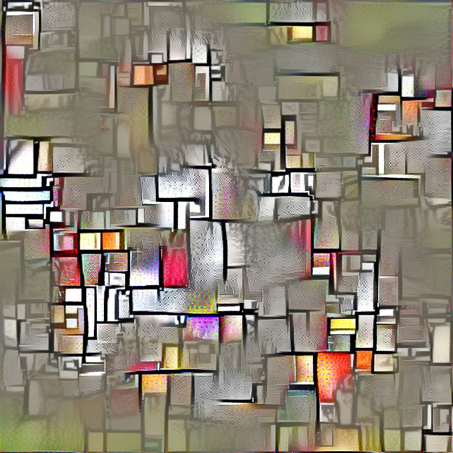

# Machine Learning with art, Artist who use that tool.

_รวมรายชื่อศิลปิน ผลงาน และงานวิจัยที่เกี่ยวข้อง จากการรวบรวมข้อมูลทำวิทยานิพนธ์ เพื่อใช้ศึกษาความเป็นไปของศิลปะที่ใช้การเรียนรู้ของเครื่อง (Machine learning) มาเป็นเครื่องมือในการสร้างสรรค์ผลงาน โดยจะแสดงรายละเอียดต่างๆ เช่นแนวคิด และเทคนิคที่ศิลปินใช้ในแต่ละผลงานเท่าที่จะหาได้ หากสนใจเพิ่มเติมสามารถเข้าไปดูในลิงค์ที่มีทำเครื่องหมาย **[>]** ของแต่ละศิลปินได้ เพราะในนี้จะไม่นำผลงานที่ไม่ได้เกี่ยวข้องกับการใช้การเรียนรู้ของเครื่องมาใช้_

## category
+ [คำนิยามที่เกี่ยวข้อง](#Defined)
+ [ศิลปิน](#List)
+ งานวิจัยที่เกี่ยวข้อง 

-----
## Defined 
- Generative art
	**เจเนอร์เรทีฟอาร์ต** ในความหมายทั่วไปคือศิลปะที่เกี่ยวข้องการใช้คอมพิวเตอร์มาสร้างสรรค์ผลงาน โดยแสดงออกเป็นการรวมกันหรือผสมกันของทัศนธาตุพื้นฐานจนเกิดเป็นภาพที่มีความซับซ้อนขึ้น แต่ความหมายดังกล่าวค่อนข้างซ้อนทับกับ **ศิลปะอัลกอริทึม (Algorithmic art)** ซึ่งใช้คอมพิเตอร์เป็นเครื่องมือในการสร้างสรรค์ผลงานเช่นกัน หลังจากได้ศึกษาเพิ่มเติมผมจึงนิยามว่า **เจนเนอร์เรทีฟอาร์ต** คือศิลปะที่ใช้แนวคิดของระบบที่มีความเป็นอิสระ หรือเจตจำนงเสรี ศิลปินมีอำนาจต่อกระบวนการสร้างสรรค์น้อย อ้างอิงจาก **["Generative Art Theory"](https://philipgalanter.com/downloads/ga2003_what_is_genart.pdf)** โดย Philip Galanter 

- Algorithmic art

- Machine learning

-----

## List
- [Gene Kogan](#Gene-Kogan) 
- [Kyle McDonald](#Kyle-McDonald)
- [Memo Akten](#Memo-Akten)
- [Mario Klingemann](#Mario-Klingemann)

-----
### Gene Kogan 
[>](http://genekogan.com) 
ศิลปิน

### Kyle McDonald 
[>](https://kylemcdonald.net)

### Memo Akten 
[>](http://www.memo.tv/works/#)

### Mario Klingemann 
[>](http://quasimondo.com)
